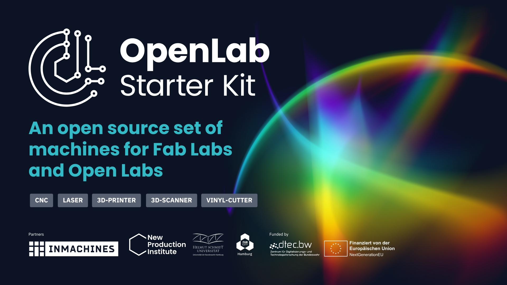

# OpenLab Starter Kit (OLSK)

A global approach to local production.

The OpenLab Starter Kit (OLSK) is an open source set of digital fabrication machines for Fab Labs and Open Labs. It is the result of the collaboration between the New Production Institute at Helmut Schmidt University and InMachines.

Setting up a digital fabrication lab often involves high costs and imported machines. OLSK offers an alternative. It includes a set of 8 digital manufacturing machines such as 3D printers, laser cutters, CNC milling machines, 3D scanners, and vinyl cutters.

## Goals

- Develop open source manufacturing machines
- Build labs using only open source hardware and software
- Document every step of the build and use process
- Share knowledge about how machines work
- Bridge the gap between open and commercial machines
- Lower the entry point for digital manufacturing
- Enable people to replicate and modify machines
- Support local production and circular practices in Fab Cities

## Get Involved

We welcome collaboration. Explore the repositories, build machines, improve the designs, and contribute to documentation. Let’s make digital manufacturing accessible everywhere.
